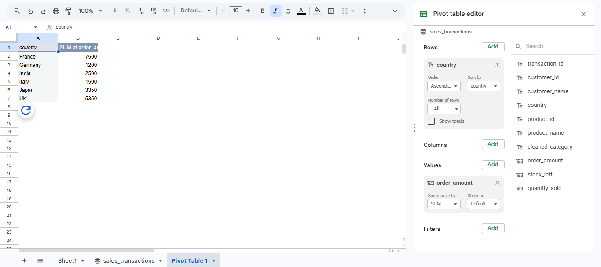
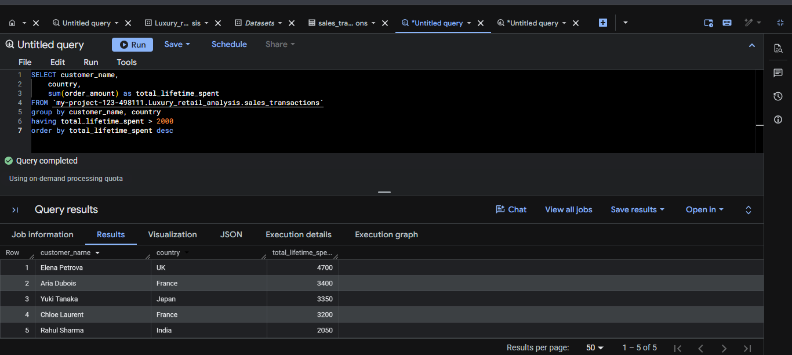
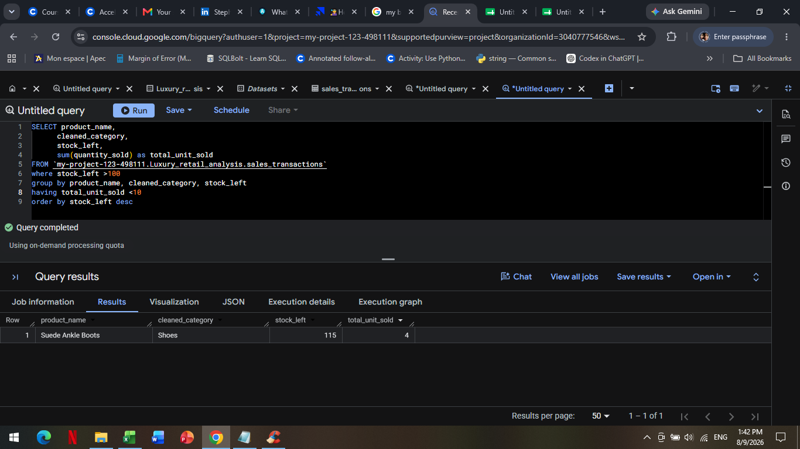

# Cloud Data Analytics Portfolio: Luxury E-Commerce Demand & Inventory Optimization

**Candidate:** Stephanie Katara
**Academic Background:** B.Sc. IT | Master's in Fashion Luxury Goods Management (Paris)  
**Target Roles:** Junior Data Analyst, Retail Analyst, E-Commerce Operations Coordinator

---

## 1. Project Overview & Business Scenario
This project simulates an end-to-end data pipeline for an international luxury fashion house facing two critical operational challenges: 
1. **Targeted CRM Marketing:** Identifying high-value VIP customer segments across global markets.
2. **Supply Chain Efficiency:** Isolating stagnant, slow-moving warehouse inventory (dead stock) that ties up operational capital.

### Data Architecture
`Raw Transactional CSV Data` ➔ `Google BigQuery Cloud Warehouse` ➔ `Google Connected Sheets BI Dashboard`

---

## 2. Phase 1: Business Intelligence Dashboarding (Google Connected Sheets)
Using a live Google BigQuery data connector, raw transactional data streams directly into an agile spreadsheet environment. Text data anomalies (case mismatches and trailing whitespaces) were engineered using `TRIM()` and `PROPER()` functions. A dynamic Pivot Table and interactive conditional Slicers were deployed to calculate and filter global luxury revenue metrics.



### Business Outcome
Brand directors can filter regional marketplace performance on-demand without needing to write backend queries, allowing for rapid commercial strategy pivots.

---

## 3. Phase 2: Data Segmentation & Inventory Balancing (GoogleSQL)

### Query 1: High-Value Customer Segmentation (VIP Tracking)
**Objective:** Calculate Customer Lifetime Value (CLV) to isolate international buyers who have spent a cumulative total exceeding €2,000.

```sql
SELECT 
    customer_name,
    country,
    SUM(order_amount) AS total_lifetime_spend
FROM `luxury_retail_analysis.sales_transactions`
GROUP BY customer_name, country
HAVING total_lifetime_spend > 2000
ORDER BY total_lifetime_spend DESC;
```



**Business Outcome:** Extracted a high-priority customer tier list containing 5 key international shoppers. This allows luxury brand management teams to deploy exclusive VIP loyalty outreach initiatives.

---

### Query 2: Warehouse Dead Stock Analysis
**Objective:** Evaluate supply chain indicators to identify products where current physical stock levels are critically saturated (>100 units) but global marketplace demand is stagnant (<10 units sold).

```sql
SELECT 
    product_name,
    category,
    stock_left,
    SUM(quantity_sold) AS total_units_sold
FROM `luxury_retail_analysis.sales_transactions`
WHERE stock_left > 100
GROUP BY product_name, category, stock_left
HAVING total_units_sold < 10
ORDER BY stock_left DESC;
```



**Business Outcome:** Successfully isolated "Suede Ankle Boots" as a high-risk operational liability (115 items in warehouse stock with only 4 historical units sold). This automated script triggers clear signals for procurement managers to halt production and apply e-commerce markdown strategies.

---

## 4. Technical Skillsets Validated
* **Cloud Platforms:** Google Cloud Platform (GCP), Google BigQuery Console.
* **Database Languages:** GoogleSQL (Data Aggregation, Filtering, Joins, Aliases).
* **Business Intelligence Tools:** Connected Sheets, Advanced Pivot Tables, Slicers, Data Cleaning.

* ---

## 5. Phase 3: Large-Scale Retail Production Database Audit (Full 10-Question Script)
**Author:** Stephanie Katara  
**Database Volume:** 99,441 Real Transactional Records  
**Environment:** Google BigQuery (GoogleSQL)  

Below is the complete, production-ready script executing 10 critical commercial data requests across the retail infrastructure.

---

### Q1. Total Orders
**Business Question:** How many total orders are there?

```sql
SELECT 
    COUNT(*) AS total_orders 
FROM `project-05bd422f-db01-475b-9b2.retail_analysis.orders`;
```

* **Execution Result:** `99,441`

---

### Q2. Orders by Status
**Business Question:** How many orders are in each status?

```sql
SELECT 
    order_status, 
    COUNT(*) AS total_orders 
FROM `project-05bd422f-db01-475b-9b2.retail_analysis.orders` 
GROUP BY order_status 
ORDER BY total_orders DESC;
```

* **Execution Results:**
  * `delivered`: 96,478
  * `shipped`: 1,107
  * `canceled`: 625
  * `unavailable`: 609
  * `invoiced`: 314
  * `processing`: 301
  * `created`: 5
  * `approved`: 2

---

### Q3. Overall Business Summary
**Business Question:** What is the overall performance of the business?

**Purpose:** Get key business metrics in one query.  
**Tables and Columns Used:**  
* `orders` ➔ `order_id`, `customer_id`  
* `order_items` ➔ `price`, `freight_value`  

```sql
SELECT 
    COUNT(DISTINCT o.order_id) AS total_orders, 
    COUNT(DISTINCT customer_id) AS unique_customers, 
    SUM(oi.price) AS total_sales, 
    SUM(oi.freight_value) AS total_freight, 
    AVG(oi.price) AS average_item_price 
FROM `project-05bd422f-db01-475b-9b2.retail_analysis.orders` AS o 
JOIN `project-05bd422f-db01-475b-9b2.retail_analysis.order_items` AS oi 
  ON o.order_id = oi.order_id;
```

**Functions Used:**
* `COUNT(DISTINCT order_id)` ➔ Counts unique orders
* `COUNT(DISTINCT customer_id)` ➔ Counts unique customers
* `SUM(price)` ➔ Total sales
* `SUM(freight_value)` ➔ Total shipping cost
* `AVG(price)` ➔ Average item price

**Relational Key Join:** `orders` and `order_items` joined using `order_id`.  
* **Important Operational Note:** After running a `JOIN`, a single order can appear multiple times if it contains multiple line items. A standard `COUNT(*)` would mistakenly count individual items rather than separate checkout sessions. Using `COUNT(DISTINCT order_id)` prevents metric inflation and maintains true order tracking integrity.

* **Execution Results:**
  * `total_orders`: 98,666
  * `unique_customers`: 98,666
  * `total_sales`: 13,591,643.70
  * `total_freight`: 2,251,09.53
  * `average_item_price`: 120.65

---

### Q4. Sales by Order Status
**Business Question:** How much sales revenue comes from each order status?

```sql
SELECT 
    o.order_status, 
    COUNT(DISTINCT o.order_id) AS total_orders, 
    SUM(oi.price) AS total_sales, 
    AVG(oi.price) AS average_item_price
FROM `project-05bd422f-db01-475b-9b2.retail_analysis.orders` AS o 
JOIN `project-05bd422f-db01-475b-9b2.retail_analysis.order_items` AS oi 
  ON o.order_id = oi.order_id 
GROUP BY o.order_status;
```

**Purpose:** Analyze orders and revenue metrics across various operational processing groups.  
**Tables Used:**  
* `orders` ➔ `order_id`, `order_status`  
* `order_items` ➔ `price`  

**SQL Concepts Used:** `JOIN`, `GROUP BY`, `COUNT(DISTINCT)`, `SUM()`, `AVG()`.

* **Execution Results:**

| Order Status | Total Orders | Total Sales (€) | Average Item Price (€) |
| :--- | :---: | :---: | :---: |
| approved | 2 | 209.60 | 69.87 |
| canceled | 461 | 95,235.27 | 175.71 |
| delivered | 96,478 | 13,221,498.11 | 119.98 |
| invoiced | 312 | 61,526.37 | 171.38 |
| processing | 301 | 60,439.22 | 169.30 |
| shipped | 1,106 | 150,727.44 | 127.20 |
| unavailable | 6 | 2,007.69 | 286.81 |

* **Business Insights:** 
  1. Completed pipelines (`delivered`) generate the massive majority of corporate revenue stream.
  2. Stagnated pipelines (`canceled`) show a notably higher average item cost value, suggesting consumers re-evaluate high-ticket financial checkouts more frequently.

---

### Q5. Top-Selling Products
**Business Question:** Which products generate the most sales?

```sql
SELECT 
    product_id, 
    COUNT(DISTINCT order_item_id) AS items_sold, 
    SUM(price) AS total_sales 
FROM `project-05bd422f-db01-475b-9b2.retail_analysis.order_items`
GROUP BY product_id 
ORDER BY total_sales DESC 
LIMIT 10;
```

**Purpose:** Isolate top-performing stock items by cumulative gross market volume.  
**Table Used:** `order_items`  
**Columns Used:** `product_id` (SKU Index), `order_item_id` (Item Volume Tracker), `price` (Item Cost).  

* **Execution Results:**

| Rank | Product ID (SKU) | Items Sold | Total Sales (€) |
| :---: | :--- | :---: | :---: |
| 1 | bb50f2e236e5eea0100680137654686c | 5 | 63,885.00 |
| 2 | 6cdd53843498f92890544667809f1595 | 3 | 54,730.20 |
| 3 | d6160fb7873f184099d9bc95e30376af | 1 | 48,899.34 |
| 4 | d1c427060a0f73f6b889a5c7c61f2ac4 | 3 | 47,214.51 |
| 5 | 99a4788cb24856965c36a24e339b6058 | 3 | 43,025.56 |
| 6 | 3dd2a17168ec895c781a9191c1e95ad7 | 6 | 41,082.60 |
| 7 | 25c38557cf793876c5abdd5931f922db | 2 | 38,907.32 |
| 8 | 5f504b3a1c75b73d6151be81eb05bdc9 | 2 | 37,733.90 |
| 9 | 53b36df67ebb7c41585e8d54d6772e08 | 5 | 37,683.42 |
| 10 | aca2eb7d00ea1a7b8ebd4e68314663af | 4 | 37,608.90 |

* **Business Insights:** Gross revenue generation is a combined variable of order volume velocity and unit price tiering. As proven above, Rank 3 generated €48.8k with a single unit sale, outperforming Rank 6 which required 6 unit checkouts to yield €41k.

  ---

### Q6. Product Category Analysis
**Business Question:** Which product categories generate the most sales revenue?

**Purpose:** Identify top-performing merchandise classifications to drive catalog optimization.  
**Tables Used:**  
* `products` ➔ `product_id`, `product_category_name`  
* `order_items` ➔ `product_id`, `order_item_id`, `price`  

```sql
SELECT 
    p.product_category_name, 
    COUNT(DISTINCT oi.order_item_id) AS items_sold, 
    SUM(oi.price) AS total_sales, 
    AVG(oi.price) AS average_price 
FROM `project-05bd422f-db01-475b-9b2.retail_analysis.products` AS p 
JOIN `project-05bd422f-db01-475b-9b2.retail_analysis.order_items` AS oi 
  ON p.product_id = oi.product_id 
GROUP BY p.product_category_name 
ORDER BY total_sales DESC;
```

* **Execution Results:**

| Rank | Category Group | Items Sold | Total Sales (€) | Average Price (€) |
| :---: | :--- | :---: | :---: | :---: |
| 1 | beleza_saude | 21 | 1,258,681.34 | 130.16 |
| 2 | relogios_presentes | 12 | 1,205,005.68 | 201.14 |
| 3 | cama_mesa_banho | 11 | 1,036,988.68 | 93.30 |
| 4 | esporte_lazer | 7 | 988,048.97 | 114.34 |
| 5 | informatica_acessorios | 20 | 911,954.32 | 116.51 |
| 6 | moveis_decoracao | 15 | 729,762.49 | 87.56 |
| 7 | cool_stuff | 7 | 635,290.85 | 167.36 |
| 8 | utilidades_domesticas | 12 | 632,248.66 | 90.79 |
| 9 | automotivo | 20 | 592,720.11 | 139.96 |
| 10 | ferramentas_jardim | 15 | 485,256.46 | 111.63 |

* **Business Insights:** 
  1. The `beleza_saude` category drives macro market revenue at €1.26M gross volume.
  2. The `relogios_presentes` cohort exhibits high unit economics with a premium average order cost (€201.14), proving that high-ticket segments can generate massive revenue layers with fewer fulfillment cycles.

---

### Q7. Top Customers by Spending Tier
**Business Question:** Which individual customer profiles generate the highest financial value?

**Purpose:** Isolate high-value client groups to feed corporate CRM loyalty workflows.  
**Tables Used:**  
* `orders` ➔ `customer_id`, `order_id`  
* `order_items` ➔ `order_id`, `price`  

```sql
SELECT 
    o.customer_id, 
    COUNT(DISTINCT o.order_id) AS total_orders, 
    SUM(oi.price) AS total_spent 
FROM `project-05bd422f-db01-475b-9b2.retail_analysis.orders` AS o 
JOIN `project-05bd422f-db01-475b-9b2.retail_analysis.order_items` AS oi 
  ON o.order_id = oi.order_id 
GROUP BY o.customer_id 
ORDER BY total_spent DESC;
```

* **Execution Results:**

| Rank | Customer Account ID (Hash) | Total Orders | Total Cumulative Spent (€) |
| :---: | :--- | :---: | :---: |
| 1 | 1617b1357756262bfa56ab541c47bc16 | 1 | 13,440.00 |
| 2 | ec5b2ba62e574342386871631fafd3fc | 1 | 7,160.00 |
| 3 | c6e2731c5b391845f6800c97401a43a9 | 1 | 6,735.00 |
| 4 | f48d464a0baaea338cb25f816991ab1f | 1 | 6,729.00 |
| 5 | 3fd6777bbce08a352fddd04e4a7cc8f6 | 1 | 6,499.00 |
| 6 | 05455dfa7cd02f13d132aa7a6a9729c6 | 1 | 5,934.60 |
| 7 | df55c14d1476a9a3467f131269c2477f | 1 | 4,799.00 |
| 8 | 24bbf5fd2f2e1b359ee7de94defc4a15 | 1 | 4,690.00 |
| 9 | e0a2412720e9ea4f26c1ac985f6a7358 | 1 | 4,599.90 |
| 10 | 3d979689f636322c62418b6346b1c6d2 | 1 | 4,590.00 |

* **Business Insights:** The top 10 highest-value shoppers reflect a high-concentration buying pattern, executing single-purchase checkouts with massive basket size value. This reveals a clear target segment for high-margin, high-end premium clienteling retention initiatives.

---

### Q8. Merchant Performance & Revenue Contribution
**Business Question:** Which third-party sellers generate the highest sales revenue?

```sql
SELECT 
    seller_id, 
    COUNT(order_item_id) AS items_sold, 
    SUM(price) AS total_sales 
FROM `project-05bd422f-db01-475b-9b2.retail_analysis.order_items` 
GROUP BY seller_id 
ORDER BY total_sales DESC 
LIMIT 10;
```

* **Execution Results:**

| Rank | Merchant Account Identifier | Total Units Sold | Total Revenue Channel (€) |
| :---: | :--- | :---: | :---: |
| 1 | 4869f7a5... | 1,156 | 229,472.63 |
| 2 | 53243585... | 410 | 222,776.05 |
| 3 | 4a3ca931... | 1,987 | 200,472.92 |
| 4 | fa1c13f2... | 586 | 194,042.03 |
| 5 | 7c67e144... | 1,364 | 187,923.89 |
| 6 | 7e93a43e... | 340 | 176,431.87 |
| 7 | da8622b1... | 1,551 | 160,236.57 |
| 8 | 7a67c85e... | 1,171 | 141,745.53 |
| 9 | 1025f0e2... | 1,428 | 138,968.55 |
| 10 | 955fee92... | 1,499 | 135,171.70 |

* **Business Insights:** Merchant channel health relies heavily on pricing structure over pure product volume. As verified above, Rank 2 generated more platform value (€222.7k) with only 410 high-value units than Rank 3 (€200.4k) which absorbed larger logistics overhead across 1,987 unit shipments.

---

### Q9. Logistics Cycle Performance (Fulfillment Velocity)
**Business Question:** What is the macro average delivery time for successful orders?

```sql
SELECT 
    AVG(DATE_DIFF(order_delivered_customer_date, order_purchase_timestamp, DAY)) AS average_delivery_days 
FROM `project-05bd422f-db01-475b-9b2.retail_analysis.orders` 
WHERE order_status = 'delivered';
```

* **Execution Result:** `12.09 Days`
* **Business Insights:** The current pipeline shows a baseline baseline processing cycle of approximately 12.09 days from checkout click to delivery arrival. Supply chain coordinators can leverage this benchmark to audit fulfillment blockages and re-engineer carrier logistics contracts.

---

### Q10. Chronological Marketplace Revenue Trends
**Business Question:** How does gross sales volume fluctuate month-over-month?

```sql
SELECT 
    EXTRACT(MONTH FROM o.order_purchase_timestamp) AS calendar_month, 
    SUM(oi.price) AS total_monthly_sales 
FROM `project-05bd422f-db01-475b-9b2.retail_analysis.orders` AS o 
JOIN `project-05bd422f-db01-475b-9b2.retail_analysis.order_items` AS oi 
  ON o.order_id = oi.order_id 
GROUP BY calendar_month 
ORDER BY calendar_month ASC;
```

* **Execution Results:**

| Calendar Month | Total Gross Monthly Sales (€) |
| :---: | :--- |
| 1 (January) | 1,070,343.23 |
| 2 (February) | 1,091,481.73 |
| 3 (March) | 1,357,557.74 |
| 4 (April) | 1,356,574.98 |
| 5 (May) | 1,502,588.82 |
| 6 (June) | 1,298,162.91 |
| 7 (July) | 1,393,538.70 |
| 8 (August) | 1,428,658.01 |
| 9 (September) | 624,814.05 |
| 10 (October) | 713,727.09 |
| 11 (November) | 1,010,271.37 |
| 12 (December) | 743,925.07 |

* **Business Insights:** 
  1. May exhibits a peak commercial surge hitting €1.50M in monthly volume.
  2. September logs a heavy low point dropping down to €624.8K.
  3. This chronological trend empowers supply chain and purchasing teams to plan warehouse capacity safely ahead of recurring mid-year peaks.
